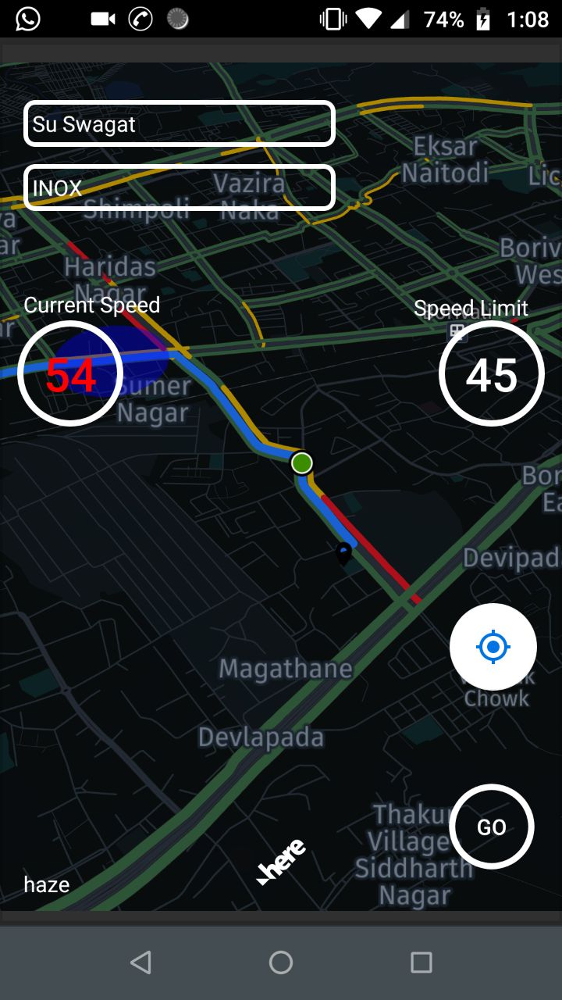
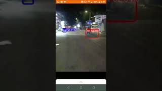
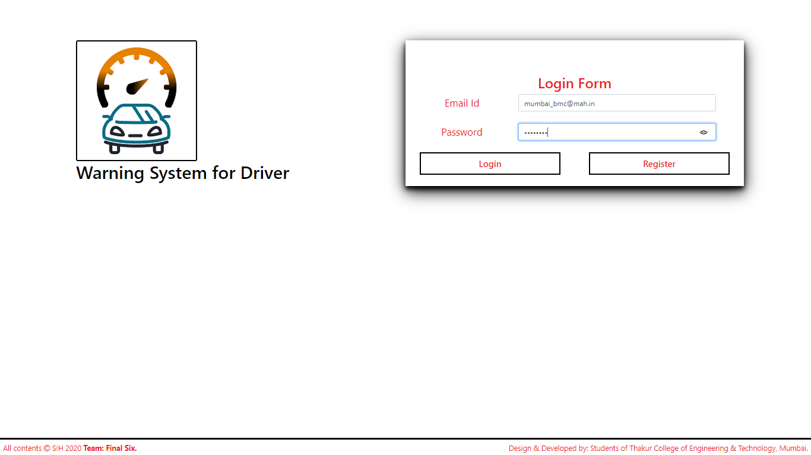
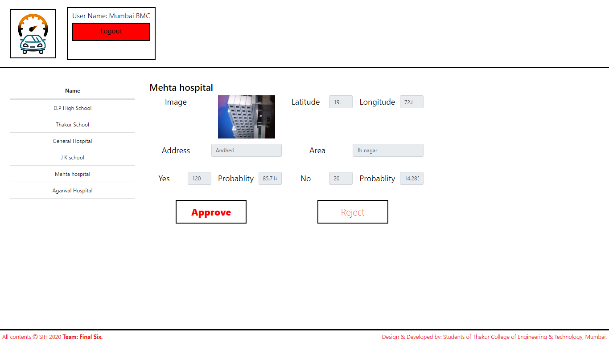

# SIH202_UK149_FINAL-SIX_Warning-System-For-Drivers_COEP

Final Six sih2020 repository for progress tracking

* Old Organisatin: [Final Six SIH2020](https://github.com/Final-Six-SIH2020)

### Tracking Progress

* **Mobile Detection:**
  * _Classification:_ 
    1) Added data CSVs.
    2) Added trainig notebook for speed sign classification
    3) Added Converted tflite model
  * _Detection:_
    1) Added Previously tested models, configs
    2) Added Training notebooks.
    3) Updated scripts for demo video generation and inclusion of mentor inputs
  * Flood Classification:
    1) Extaction and creation of flood dataset
    2) Building a small and powerful model to run on mobile devices
    3) demo video added.
  
* **Android:**
  1) Version 1: added
     1) Get speed limit.
     2) Retrieve Current Speed
     3) Location Recognition.
     4) Voice Alert
  2) Version 2: Mentor Inputs added
  3) Relevant Objects counting and detection added
* **Website:**
  * Added Admin login panel
  * Merged Firebase database
  * Added screen to approve or discard new places.

* _Demo Files:_
  * Final App Screen    
    

 * PC Object Detection Demo:
   
   

 * Mobile Object Detection:
   
   

 * Flood Detection:
   
   
 
 * Counting Relevant Object using only the camera live feed and object detection

   

  * Website Interface:
    
    